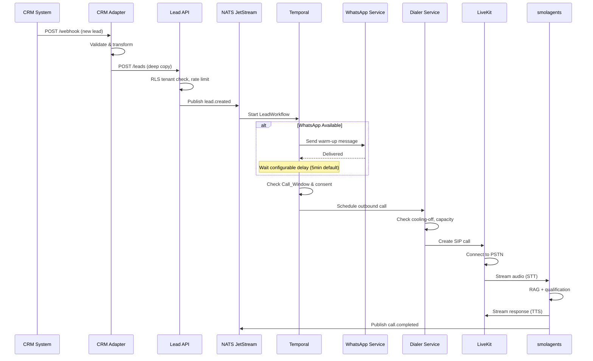
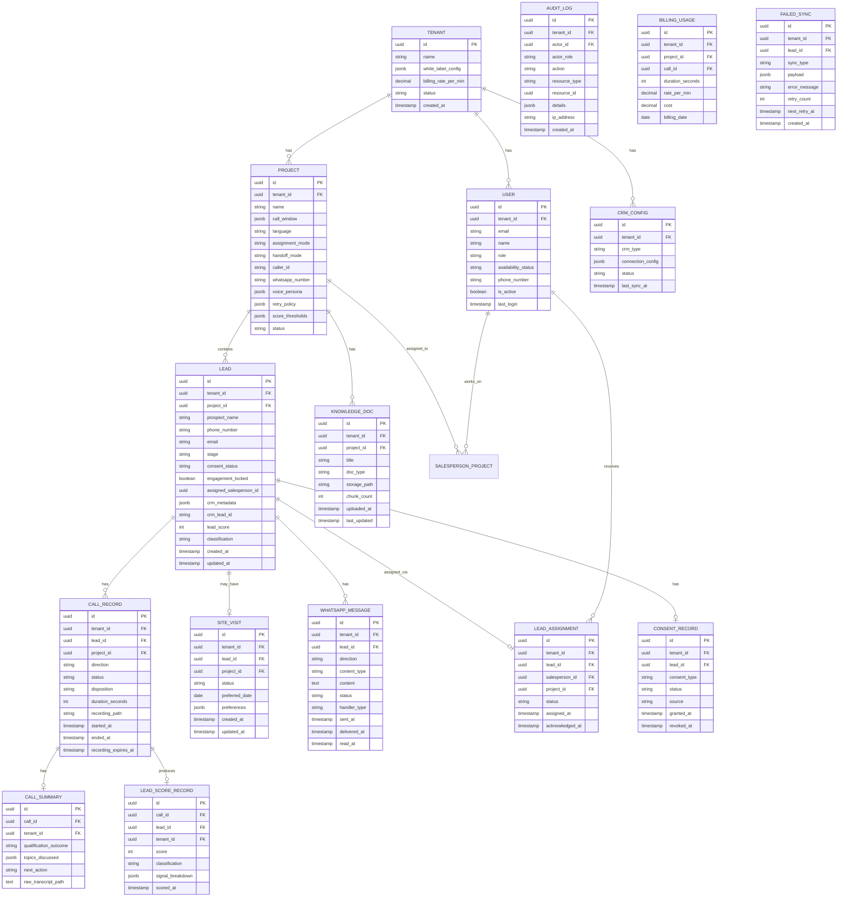

# Design Document: AI Pre-Sales Execution Engine

## Overview

The AI Pre-Sales Execution Engine is a multi-tenant white-label SaaS platform that automates real estate lead qualification through AI voice calling, WhatsApp engagement, and intelligent routing. The system receives leads from client CRMs, qualifies prospects via AI-powered phone conversations grounded in project-specific knowledge, scores purchase intent, assigns qualified leads to salespersons, and tracks engagement through to site visit booking.

### Design Principles

1. **Pointfree / Pure Core**: Business logic is expressed as pure functions with algebraic types. Side effects (I/O, telephony, messaging) are pushed to the edges via adapter interfaces.
2. **Event-Driven Architecture**: All state transitions publish domain events to NATS JetStream. Services react to events, enabling loose coupling and replay capability.
3. **Adapter Pattern**: External integrations (CRM, WhatsApp, telephony) are abstracted behind typed interfaces, allowing swap-out without core logic changes.
4. **Smart Defaults with Override**: All configurable values ship with production-ready defaults (call windows, retry policies, scoring thresholds) that tenants can override.
5. **Engagement Lock**: Once a lead is assigned to a human, all automated outbound ceases until explicitly released.
6. **Consent Hard-Gate**: No outbound communication occurs without verified consent status.
7. **Cooling-Off Enforcement**: Per-phone-number rate limiting prevents spam-like call patterns.

### Key Technical Decisions

| Decision | Choice | Rationale |
|----------|--------|-----------|
| Orchestration | Temporal | Durable workflows with retry, timer, and saga support for lead lifecycle |
| Messaging | NATS JetStream | Low-latency event pub-sub with at-least-once delivery and tenant-scoped subjects |
| Voice | LiveKit SIP + Parakeet STT + Qwen3-TTS | Open-source stack with sub-1500ms latency target |
| AI Agent | smolagents + pgvector RAG | Lightweight agent framework with vector retrieval via PostgreSQL pgvector extension |
| Cache/Locks | Valkey | Redis-compatible with tenant-namespaced keys for caching and distributed locks |
| Multi-tenancy | PostgreSQL RLS | Cost-effective shared-database model with row-level security enforcement |
| Object Storage | S3/MinIO | Tenant-prefixed paths for recordings and documents |
| Dashboard | Next.js | SSR for SEO-friendly tenant-branded domains, WebSocket for real-time updates |
| API | FastAPI | Async Python with strong typing, OpenAPI generation, middleware for tenant context |
| Analytics | Metabase | Direct SQL access for custom dashboards without building report builder |
| Observability | OpenTelemetry + Prometheus + Grafana + Sentry | Full-stack tracing, metrics, alerting, and error tracking |

## Technology Stack & Libraries

### Backend Libraries (Python 3.12+)

| Category | Library | Purpose |
|----------|---------|---------|
| Web framework | FastAPI + uvicorn | Async API with OpenAPI generation |
| Auth | fastapi-users (v13+) | Registration, login, JWT, OAuth2, custom user model |
| CRUD | fastcrud | Auto-generated async CRUD with pagination, filtering, sorting |
| ORM | SQLAlchemy 2.0 (async) + alembic | Database models, migrations |
| Validation | Pydantic v2 | Request/response schemas |
| Settings | pydantic-settings | Typed env vars with .env support |
| Logging | structlog | Structured JSON logging with context vars |
| HTTP client | httpx + tenacity | Async HTTP with decorator-based retry/backoff |
| Workflow | temporalio | Durable workflows, activities, signals |
| Events | nats-py | NATS JetStream pub-sub |
| Cache | redis[hiredis] (Valkey-compatible) | Caching, locks, rate limiting |
| Vector DB | pgvector (PostgreSQL extension) | RAG retrieval — zero extra service, RLS applies to vectors too |
| AI Agent | smolagents | Conversation orchestration, tool-calling |
| Telephony | livekit + livekit-agents | SIP calls, voice pipeline |
| Storage | boto3 / aiobotocore | S3/MinIO compatible storage |
| Observability | opentelemetry-sdk + sentry-sdk | Tracing, metrics, error tracking |
| Email | resend | Transactional email for digests |
| Testing | hypothesis + pytest + testcontainers | Property-based tests with real infra |

### Frontend Libraries (TypeScript)

| Category | Library | Purpose |
|----------|---------|---------|
| Framework | Next.js 14+ (App Router) | SSR, RSC, route groups |
| UI Components | shadcn/ui + Radix UI | Pre-built accessible components |
| Data Fetching | @tanstack/react-query v5 | Server state, caching, background revalidation |
| Data Tables | @tanstack/react-table | Sorting, filtering, pagination |
| Forms | react-hook-form + zod | Zero-rerender forms with schema validation |
| Client State | zustand | Minimal UI-only state |
| Charts | recharts | Analytics visualizations |
| Icons | lucide-react | 1000+ icons |
| Toasts | sonner | Notifications |
| Styling | Tailwind CSS v4 | Utility-first CSS |
| Phone | libphonenumber-js | Indian phone number formatting |
| Date | date-fns | Date formatting/manipulation |

## Codebase Structure

```
Project Root
├── backend/                    # Python backend (Hexagonal Architecture)
│   ├── core/                   # Pure domain (ZERO external deps)
│   │   ├── types.py           # Algebraic types, enums
│   │   ├── models.py          # Frozen dataclasses
│   │   ├── events.py          # Domain event types
│   │   ├── errors.py          # Result[T,E], domain errors
│   │   ├── lead/              # Lead domain (state machine, scoring, assignment)
│   │   ├── call/              # Call domain (window, cooling-off, priority)
│   │   ├── consent/           # Consent domain (gate, keywords)
│   │   ├── billing/           # Billing domain (cost computation)
│   │   └── retry/             # Retry domain (backoff)
│   ├── ports/                  # Protocol interfaces (what system NEEDS)
│   ├── adapters/               # I/O implementations (ALL side effects here)
│   │   ├── postgres/          # SQLAlchemy ORM + repos + tenant session
│   │   ├── valkey/            # Cache, rate limiter, locks
│   │   ├── nats/              # Event publisher + consumers
│   │   ├── temporal/          # Workflows + activities
│   │   ├── livekit/           # Dialer + transfer
│   │   ├── whatsapp/          # Cloud API + webhooks
│   │   ├── crm/               # Salesforce, HubSpot, generic
│   │   └── s3/                # Object storage
│   ├── api/                    # FastAPI routes (thin glue)
│   │   ├── middleware/        # tenant, auth, rate_limit, audit
│   │   └── routes/            # leads, calls, tenants, projects, auth, etc.
│   ├── voice_agent/           # Separate process (LiveKit agent runtime)
│   ├── workers/               # Temporal worker process
│   └── tests/                 # properties/ + integration/
├── frontend/                   # Next.js (Feature-Sliced Design)
│   └── src/
│       ├── app/               # Routes only (App Router)
│       ├── features/          # Self-contained domain slices
│       │   ├── leads/         # API hooks, types, components
│       │   ├── calls/
│       │   ├── whatsapp/
│       │   ├── notifications/
│       │   ├── analytics/
│       │   └── auth/
│       └── shared/            # Cross-feature (UI atoms, hooks, providers, lib)
└── docker-compose.yml
```

Dependency rule: `core ← ports ← adapters ← api`. Never backward.
Frontend rule: `shared ← features ← app`. Never cross-feature.

## Architecture

### High-Level System Architecture

```mermaid
graph TB
    subgraph External
        CRM[CRM Systems]
        PSTN[PSTN / SIP Trunk]
        WA[WhatsApp Cloud API]
    end

    subgraph Ingestion Layer
        CRM_ADAPTER[CRM Adapter Service]
        LEAD_API[Lead API]
    end

    subgraph Event Bus
        NATS[NATS JetStream]
    end

    subgraph Orchestration
        TEMPORAL[Temporal Server]
        WORKERS[Temporal Workers]
    end

    subgraph Voice Pipeline
        DIALER[Dialer Service]
        LIVEKIT[LiveKit Server]
        STT[Parakeet STT]
        TTS[Qwen3-TTS]
    end

    subgraph AI Layer
        AGENT[smolagents Engine]
        PGVEC[pgvector in PostgreSQL]
        SCORER[Lead Scorer]
    end

    subgraph Communication
        WA_SERVICE[WhatsApp Service]
        NOTIFIER[Notification Service]
    end

    subgraph Data Layer
        PG[(PostgreSQL + RLS)]
        VALKEY[(Valkey Cache)]
        S3[(S3/MinIO Storage)]
    end

    subgraph Presentation
        DASHBOARD[Next.js Dashboard]
        WS[WebSocket Gateway]
    end

    subgraph Observability
        OTEL[OpenTelemetry Collector]
        PROM[Prometheus]
        GRAFANA[Grafana]
        SENTRY[Sentry]
        METABASE[Metabase]
    end

    CRM -->|webhook/polling| CRM_ADAPTER
    CRM_ADAPTER --> LEAD_API
    LEAD_API --> NATS
    NATS --> TEMPORAL
    TEMPORAL --> WORKERS

    WORKERS -->|schedule call| DIALER
    WORKERS -->|send message| WA_SERVICE
    WORKERS -->|assign lead| NOTIFIER

    DIALER --> LIVEKIT
    LIVEKIT <--> PSTN
    LIVEKIT --> STT
    AGENT --> TTS
    TTS --> LIVEKIT
    STT --> AGENT
    AGENT --> PGVEC

    AGENT -->|call outcome| NATS
    NATS -->|sync| CRM_ADAPTER
    NATS -->|notify| NOTIFIER
    NATS -->|update| WA_SERVICE

    WA_SERVICE <--> WA
    NOTIFIER --> WS
    WS --> DASHBOARD

    WORKERS --> PG
    LEAD_API --> PG
    AGENT --> PG
    DIALER --> VALKEY
    WORKERS --> VALKEY
    DIALER --> S3

    PG --> METABASE
    OTEL --> PROM
    PROM --> GRAFANA
end
```

### Request Flow: Lead Ingestion to First Call



### Multi-Tenancy Isolation Model

```mermaid
graph LR
    subgraph "Shared Infrastructure"
        PG[PostgreSQL + pgvector]
        NATS[NATS JetStream]
        VALKEY[Valkey]
        S3[S3/MinIO]
    end

    subgraph "Isolation Mechanisms"
        RLS[Row-Level Security<br/>tenant_id on all rows<br/>includes vector tables]
        SCOPE[Scoped Subjects<br/>tenant.{id}.event.*]
        NS[Namespaced Keys<br/>t:{id}:resource:key]
        PREFIX[Prefixed Paths<br/>/{tenant_id}/recordings/*]
    end

    PG --- RLS
    NATS --- SCOPE
    VALKEY --- NS
    S3 --- PREFIX
```

## Components and Interfaces

### Service Decomposition

> **Note:** All services run as modules within a single FastAPI application process, except `voice-agent` (separate LiveKit agent runtime) and `workflow-worker` (Temporal worker). The hexagonal structure allows future service extraction without code changes to domain logic.

| Service | Responsibility | Language | Framework |
|---------|---------------|----------|-----------|
| `lead-api` | Lead CRUD, validation, rate limiting, tenant context | Python | FastAPI |
| `crm-adapter` | CRM webhook handling, field mapping, sync-back | Python | FastAPI |
| `workflow-worker` | Temporal activity execution (scheduling, assignment, SLA) | Python | Temporal SDK |
| `dialer-service` | Call capacity management, cooling-off, LiveKit SIP orchestration | Python | FastAPI + LiveKit SDK |
| `voice-agent` | Real-time STT/TTS pipeline, smolagents conversation loop | Python | LiveKit Agents SDK |
| `lead-scorer` | Post-call scoring, threshold classification | Python | FastAPI |
| `whatsapp-service` | WhatsApp Cloud API integration, template management | Python | FastAPI |
| `notification-service` | Multi-channel dispatch (WebSocket, WhatsApp, email) | Python | FastAPI |
| `knowledge-service` | KB upload, chunking, pgvector indexing | Python | FastAPI |
| `auth-service` | JWT issuance, RBAC enforcement, session management | Python | FastAPI |
| `billing-service` | Usage tracking, cost computation | Python | FastAPI |
| `dashboard` | Tenant-branded UI, real-time updates | TypeScript | Next.js |

### Core Interfaces (Type Signatures)

```python
# --- Tenant Context (injected via middleware) ---
@dataclass(frozen=True)
class TenantContext:
    tenant_id: UUID
    user_id: UUID
    role: Role  # SuperAdmin | TenantAdmin | SalesManager | Salesperson
    project_ids: list[UUID]  # accessible projects

# --- Lead API ---
class LeadService(Protocol):
    async def create_lead(self, ctx: TenantContext, payload: LeadCreatePayload) -> Lead: ...
    async def get_lead(self, ctx: TenantContext, lead_id: UUID) -> Lead: ...
    async def update_stage(self, ctx: TenantContext, lead_id: UUID, stage: LeadStage) -> Lead: ...
    async def list_leads(self, ctx: TenantContext, filters: LeadFilters, page: Pagination) -> Page[Lead]: ...

# --- CRM Adapter (Adapter Pattern) ---
class CRMAdapter(Protocol):
    async def transform_inbound(self, raw: dict) -> LeadCreatePayload: ...
    async def sync_outcome(self, lead_id: UUID, outcome: CallOutcome) -> SyncResult: ...
    async def sync_site_visit(self, lead_id: UUID, status: SiteVisitStatus) -> SyncResult: ...

# --- Dialer Service ---
class DialerService(Protocol):
    async def schedule_call(self, lead_id: UUID, project_id: UUID, priority: int) -> CallSchedule: ...
    async def check_capacity(self, tenant_id: UUID) -> CapacityStatus: ...
    async def enforce_cooling_off(self, phone: str, project_id: UUID) -> CoolingOffResult: ...

# --- Voice Agent ---
class VoiceAgent(Protocol):
    async def start_conversation(self, call_session: CallSession, kb_collection: str) -> None: ...
    async def handle_transfer_request(self, call_session: CallSession) -> TransferResult: ...
    async def generate_summary(self, call_session: CallSession) -> CallSummary: ...

# --- Lead Scorer ---
class LeadScorer(Protocol):
    def score(self, summary: CallSummary, signals: ConversationSignals) -> LeadScore: ...
    def classify(self, score: LeadScore, thresholds: ScoreThresholds) -> LeadClassification: ...

# --- WhatsApp Service ---
class WhatsAppService(Protocol):
    async def send_template(self, to: PhoneNumber, template: WATemplate, params: dict) -> MessageResult: ...
    async def send_message(self, to: PhoneNumber, content: str, from_number: PhoneNumber) -> MessageResult: ...
    async def handle_inbound(self, webhook: WAWebhook) -> InboundAction: ...

# --- Knowledge Service ---
class KnowledgeService(Protocol):
    async def index_document(self, tenant_id: UUID, project_id: UUID, doc: Document) -> IndexResult: ...
    async def search(self, tenant_id: UUID, project_id: UUID, query: str, top_k: int = 5) -> list[KBChunk]: ...
    async def list_documents(self, tenant_id: UUID, project_id: UUID) -> list[DocumentMeta]: ...

# --- Assignment Engine ---
class AssignmentEngine(Protocol):
    def assign_round_robin(self, project_id: UUID, available_salespersons: list[Salesperson]) -> Salesperson: ...
    def check_availability(self, salesperson_id: UUID) -> AvailabilityStatus: ...
    def engage_lock(self, lead_id: UUID, salesperson_id: UUID) -> None: ...
    def release_lock(self, lead_id: UUID) -> None: ...

# --- Notification Service ---
class NotificationService(Protocol):
    async def push_realtime(self, user_id: UUID, event: NotificationEvent) -> None: ...
    async def send_whatsapp_alert(self, phone: PhoneNumber, alert: SalespersonAlert) -> None: ...
    async def queue_email_digest(self, user_id: UUID, digest: DigestEntry) -> None: ...
```

### Temporal Workflow Definitions

```python
# --- Lead Lifecycle Workflow ---
@workflow.defn
class LeadWorkflow:
    """
    Orchestrates lead from creation through qualification to site visit.
    Stages: received → calling → qualified → assigned → callback_tracking → site_visit_booked
    """
    @workflow.run
    async def run(self, lead_id: UUID, tenant_id: UUID, project_id: UUID) -> WorkflowResult: ...

    # Activities
    async def check_consent(self, lead_id: UUID) -> ConsentStatus: ...
    async def send_warmup_message(self, lead_id: UUID) -> MessageResult: ...
    async def schedule_call(self, lead_id: UUID, priority: int) -> CallSchedule: ...
    async def process_call_outcome(self, lead_id: UUID, outcome: CallOutcome) -> NextAction: ...
    async def assign_lead(self, lead_id: UUID) -> AssignmentResult: ...
    async def track_callback(self, lead_id: UUID, salesperson_id: UUID) -> CallbackStatus: ...

# --- RNR Retry Workflow ---
@workflow.defn
class RNRRetryWorkflow:
    """Manages retry scheduling with cooling-off and call window enforcement."""
    @workflow.run
    async def run(self, lead_id: UUID, retry_policy: RetryPolicy) -> RetryResult: ...

# --- CRM Sync Workflow ---
@workflow.defn  
class CRMSyncWorkflow:
    """Syncs outcomes back to CRM with exponential backoff on failure."""
    @workflow.run
    async def run(self, sync_payload: SyncPayload) -> SyncResult: ...
```

### NATS JetStream Event Schema

```
Subject Pattern: tenant.{tenant_id}.{domain}.{event_type}

Subjects:
  tenant.{id}.lead.created          → LeadCreatedEvent
  tenant.{id}.lead.stage_changed    → LeadStageChangedEvent
  tenant.{id}.call.scheduled        → CallScheduledEvent
  tenant.{id}.call.started          → CallStartedEvent
  tenant.{id}.call.completed        → CallCompletedEvent
  tenant.{id}.call.rnr              → CallRNREvent
  tenant.{id}.assignment.created    → AssignmentCreatedEvent
  tenant.{id}.whatsapp.sent         → WhatsAppSentEvent
  tenant.{id}.whatsapp.received     → WhatsAppReceivedEvent
  tenant.{id}.site_visit.captured   → SiteVisitCapturedEvent
  tenant.{id}.site_visit.updated    → SiteVisitUpdatedEvent
  tenant.{id}.consent.changed       → ConsentChangedEvent
  tenant.{id}.sync.requested        → CRMSyncRequestedEvent
  tenant.{id}.sync.failed           → CRMSyncFailedEvent
  tenant.{id}.notification.hot_lead → HotLeadNotificationEvent
```

## Data Models

### Entity-Relationship Diagram



### Key Algebraic Types

```python
from enum import Enum
from typing import Union
from dataclasses import dataclass

# --- Lead Stage (state machine) ---
class LeadStage(str, Enum):
    RECEIVED = "received"
    CALLING = "calling"
    QUALIFIED = "qualified"
    ASSIGNED = "assigned"
    CALLBACK_TRACKING = "callback_tracking"
    SITE_VISIT_BOOKED = "site_visit_booked"
    UNREACHABLE = "unreachable"
    REQUIRING_MANUAL_REVIEW = "requiring_manual_review"

# --- Consent Status ---
class ConsentStatus(str, Enum):
    PENDING = "pending"
    GRANTED = "granted"
    REVOKED = "revoked"

# --- Call Disposition ---
class CallDisposition(str, Enum):
    COMPLETED = "completed"
    RNR = "rnr"
    VOICEMAIL = "voicemail"
    BUSY = "busy"
    FAILED = "failed"
    TRANSFERRED = "transferred"

# --- Lead Classification ---
class LeadClassification(str, Enum):
    HOT = "hot"
    WARM = "warm"
    COLD = "cold"

# --- Call Outcome (sum type for workflow decisions) ---
@dataclass(frozen=True)
class CallCompleted:
    summary: CallSummary
    score: LeadScore
    classification: LeadClassification

@dataclass(frozen=True)
class CallRNR:
    retry_number: int
    max_retries: int

@dataclass(frozen=True)
class CallTransferred:
    salesperson_id: UUID
    context_summary: str

@dataclass(frozen=True)
class CallOptOut:
    reason: str

CallOutcome = Union[CallCompleted, CallRNR, CallTransferred, CallOptOut]

# --- Assignment Result ---
@dataclass(frozen=True)
class AssignmentSuccess:
    salesperson_id: UUID
    salesperson_name: str

@dataclass(frozen=True)  
class NoSalespersonAvailable:
    reason: str

AssignmentResult = Union[AssignmentSuccess, NoSalespersonAvailable]

# --- Cooling Off Check ---
@dataclass(frozen=True)
class CoolingOffClear:
    pass

@dataclass(frozen=True)
class CoolingOffActive:
    next_allowed_at: datetime

CoolingOffResult = Union[CoolingOffClear, CoolingOffActive]
```

### PostgreSQL RLS Policy Pattern

```sql
-- Enable RLS on all tenant-scoped tables
ALTER TABLE leads ENABLE ROW LEVEL SECURITY;

-- Policy: Users can only access rows matching their tenant
CREATE POLICY tenant_isolation ON leads
    USING (tenant_id = current_setting('app.current_tenant_id')::uuid);

-- Set tenant context at connection/transaction level
SET app.current_tenant_id = '{tenant_uuid}';
```

### Valkey Key Patterns

```
t:{tenant_id}:call_capacity          → Current concurrent call count
t:{tenant_id}:cooling_off:{phone}    → TTL-based cooling-off flag (4h TTL)
t:{tenant_id}:round_robin:{project}  → Round-robin pointer index
t:{tenant_id}:rate_limit:leads       → Sliding window counter for lead ingestion
t:{tenant_id}:rate_limit:api         → Sliding window counter for API requests
t:{tenant_id}:session:{user_id}      → User session data
t:{tenant_id}:ws:{user_id}           → WebSocket connection metadata
```

## Correctness Properties

*A property is a characteristic or behavior that should hold true across all valid executions of a system — essentially, a formal statement about what the system should do. Properties serve as the bridge between human-readable specifications and machine-verifiable correctness guarantees.*

### Property 1: Tenant Data Isolation

*For any* two distinct tenants A and B, and any data record created by tenant A, a database query executed in tenant B's context SHALL return zero rows belonging to tenant A.

**Validates: Requirements 1.2, 1.6, 3.7, 20.2, 20.3**

### Property 2: Call Window Enforcement

*For any* timestamp and call window configuration (start_hour, end_hour, timezone), the `is_within_call_window` function SHALL return true if and only if the timestamp falls within [start_hour, end_hour) in the configured timezone.

**Validates: Requirements 1.4, 4.4, 17.5**

### Property 3: Lead Payload Validation

*For any* lead ingestion payload, the validation function SHALL accept the payload if and only if all required fields (prospect_name, phone_number, project_id) are present and non-empty strings; otherwise it SHALL reject with the specific field names that failed.

**Validates: Requirements 3.3, 3.4**

### Property 4: Sliding Window Rate Limiter

*For any* sequence of N requests arriving within a time window W, the rate limiter SHALL accept the first `limit` requests and reject/queue all subsequent requests, where `limit` is the configured threshold for that window.

**Validates: Requirements 3.9, 19.8**

### Property 5: Exponential Backoff Computation

*For any* retry attempt number n (where 0 < n ≤ max_retries) and base delay d, the computed next-retry delay SHALL equal `d * 2^(n-1)` capped at a configured maximum, and the delay SHALL be strictly monotonically increasing with n.

**Validates: Requirements 3.6, 4.7, 8.7**

### Property 6: Lead Stage Machine Validity

*For any* lead in stage S receiving event E, the stage transition function SHALL produce a valid next stage according to the defined transition table, and SHALL reject (return error) for any (S, E) pair not in the table. The same property applies to site visit status transitions (intent_captured → confirmed → completed | no_show).

**Validates: Requirements 4.1, 9.4**

### Property 7: Engagement Lock Invariant

*For any* lead where `engagement_locked = true`, all automated outbound functions (schedule_call, send_automated_whatsapp, send_warmup) SHALL return a blocked/skipped result without performing any external action.

**Validates: Requirements 4.6, 11.8**

### Property 8: SLA Breach Detection

*For any* stage entry timestamp, current timestamp, and SLA threshold duration, the `is_sla_breached` function SHALL return true if and only if (current - entry) > threshold.

**Validates: Requirements 4.8, 6.8, 10.5, 11.6**

### Property 9: Priority Queue Ordering

*For any* set of queued call requests with mixed classifications and creation timestamps, the priority dequeue order SHALL yield all Hot_Lead items before Warm items, all Warm before Cold, and within the same classification, items SHALL be ordered by ascending created_at (oldest first).

**Validates: Requirements 4.9**

### Property 10: Cooling-Off Period Enforcement

*For any* phone number that was called at timestamp T, the cooling-off check SHALL return `CoolingOffActive` for all timestamps in [T, T + 4 hours), and SHALL return `CoolingOffClear` for all timestamps ≥ T + 4 hours.

**Validates: Requirements 7.7**

### Property 11: Retry Concurrency Invariant

*For any* lead with an active retry workflow, at most one pending retry SHALL be scheduled at any point in time. When a call connects successfully, the pending retry count SHALL become zero.

**Validates: Requirements 7.5, 7.6**

### Property 12: Consent Hard-Gate

*For any* lead with consent_status ∈ {PENDING, REVOKED}, all outbound communication functions (call, WhatsApp message, warm-up) SHALL be blocked and SHALL NOT produce any external side effect.

**Validates: Requirements 17.2, 17.3**

### Property 13: Opt-Out Keyword Detection

*For any* inbound WhatsApp message text containing a configured opt-out keyword (case-insensitive match against STOP, unsubscribe, "don't message", or configured-language equivalents), the consent revocation function SHALL be triggered and consent_status SHALL transition to REVOKED.

**Validates: Requirements 8.8**

### Property 14: Round-Robin Fair Distribution

*For any* list of N available salespersons in a project, N consecutive lead assignments SHALL distribute exactly one lead to each salesperson before any salesperson receives a second assignment, skipping salespersons with availability_status ∈ {offline, busy, at_capacity}.

**Validates: Requirements 11.1, 11.3**

### Property 15: Billing Cost Computation

*For any* set of call records with duration_seconds and a per-minute rate, the total cost SHALL equal `sum(ceil(duration_seconds / 60) * rate_per_minute)` for each record, and the per-lead cost SHALL equal total_cost / lead_count. The connect rate SHALL equal count(disposition=COMPLETED) / count(all_attempts).

**Validates: Requirements 14.1, 14.3, 15.3**


## Error Handling

### Error Categories and Strategies

| Category | Examples | Strategy |
|----------|----------|----------|
| **Transient External** | CRM API timeout, WhatsApp delivery failure, PSTN congestion | Exponential backoff retry via Temporal activities (max 5 attempts) |
| **Capacity Exhaustion** | All call slots occupied, rate limit hit | Queue with priority ordering, return 429 with Retry-After header |
| **Validation Failure** | Missing lead fields, invalid phone format | Reject immediately with structured error, log for adapter debugging |
| **Consent Violation** | Attempt to contact revoked/pending lead | Hard-block at function boundary, log as compliance event |
| **Workflow Failure** | Temporal activity exhausts retries | Mark lead as `requiring_manual_review`, alert Sales_Manager |
| **Data Integrity** | RLS bypass attempt, cross-tenant access | Reject with 403, log as security event in audit log, alert Super_Admin |
| **Voice Pipeline** | STT timeout, TTS failure, LiveKit disconnect | Graceful call termination with apology, schedule retry as RNR |
| **Storage Failure** | S3 upload fails for recording | Retry 3x, then store recording path as `failed_upload` for manual recovery |

### Circuit Breaker Pattern

External service integrations (CRM sync, WhatsApp API, LiveKit) use circuit breakers:

```python
# ponytail: Circuit breaker states — closed (normal), open (failing, reject fast), half-open (probe)
# Upgrade path: per-tenant circuit breakers if one tenant's CRM failures shouldn't affect others
@dataclass(frozen=True)
class CircuitBreakerConfig:
    failure_threshold: int = 5       # failures before opening
    recovery_timeout_s: int = 60     # seconds before half-open probe
    success_threshold: int = 2       # successes in half-open to close
```

### Dead Letter Queue

Events that exhaust all retries are published to a dead-letter subject (`tenant.{id}.dlq.{original_subject}`) for manual inspection. The Super_Admin dashboard surfaces DLQ depth as a metric.

### Graceful Degradation

- If pgvector query is slow: AI agent uses cached top-K results from last similar query (stale but functional)
- If Valkey is unavailable: Rate limiting degrades to per-process in-memory counters (less accurate, prevents total failure)
- If NATS is unavailable: Critical path (call scheduling) falls back to direct Temporal signal; event consumers catch up on reconnection

## Testing Strategy

### Dual Testing Approach

| Layer | Test Type | Tool | Coverage Target |
|-------|-----------|------|-----------------|
| Pure logic (scoring, validation, state machines, scheduling) | Property-based tests | Hypothesis (Python) | 15 properties, 100+ iterations each |
| API endpoints | Example-based unit tests | pytest + httpx | Happy path + error cases per endpoint |
| Temporal workflows | Workflow unit tests | Temporal test framework | Each workflow path including failure/retry |
| Database (RLS) | Integration tests | pytest + testcontainers (PostgreSQL) | Tenant isolation across all tables |
| Voice pipeline | Integration tests | LiveKit test harness | Connection, STT/TTS flow, transfer |
| External services | Mock-based unit tests | pytest + respx/httpx-mock | CRM adapters, WhatsApp API, S3 |
| End-to-end | Integration tests | pytest + docker-compose | Lead ingestion → call → scoring → assignment |
| Performance | Load tests | Locust | Latency targets (1500ms voice, 500ms API) |
| UI | Component tests + E2E | Vitest + Playwright | Dashboard rendering, real-time updates |

### Property-Based Testing Configuration

- **Library**: Hypothesis (Python)
- **Iterations**: Minimum 100 per property, 200 for critical paths (consent, isolation, billing)
- **Tag format**: `# Feature: ai-presales-engine, Property {N}: {title}`

Properties map to test files:

```
tests/properties/
├── test_tenant_isolation.py      # Property 1
├── test_call_window.py           # Property 2
├── test_lead_validation.py       # Property 3
├── test_rate_limiter.py          # Property 4
├── test_backoff.py               # Property 5
├── test_state_machines.py        # Property 6
├── test_engagement_lock.py       # Property 7
├── test_sla_breach.py            # Property 8
├── test_priority_queue.py        # Property 9
├── test_cooling_off.py           # Property 10
├── test_retry_concurrency.py     # Property 11
├── test_consent_gate.py          # Property 12
├── test_opt_out_detection.py     # Property 13
├── test_round_robin.py           # Property 14
└── test_billing.py               # Property 15
```

### Unit Test Focus Areas

Unit tests (example-based) cover:
- API endpoint request/response contracts
- CRM adapter field mapping for each supported CRM type
- WhatsApp template rendering with variable substitution
- Notification channel routing per role configuration
- Call summary structure validation
- RBAC permission matrix (specific role/action/resource triples)
- Audit log entry creation for each auditable action

### Integration Test Focus Areas

- Tenant isolation across PostgreSQL RLS policies (multi-tenant queries)
- NATS event publishing and consumer triggering
- Temporal workflow execution (happy path, retry, failure)
- LiveKit SIP call establishment and audio streaming
- WhatsApp Cloud API message delivery and webhook handling
- CRM sync round-trip (push outcome, verify in mock CRM)
- S3/MinIO recording upload and retrieval
- pgvector indexing and retrieval accuracy

### Performance Test Targets

| Metric | Target | Test Method |
|--------|--------|-------------|
| Voice response latency | < 1500ms p95 | Locust + LiveKit test client |
| API response time | < 500ms p95 | Locust HTTP load test |
| Lead ingestion throughput | 100 leads/min/tenant | Bulk POST with timing |
| Concurrent calls | 5 per tenant (baseline) | Parallel call initiation |
| Hot lead notification | < 30s from call end | End-to-end timing |
| CRM sync latency | < 10s from event | Event-to-sync measurement |
