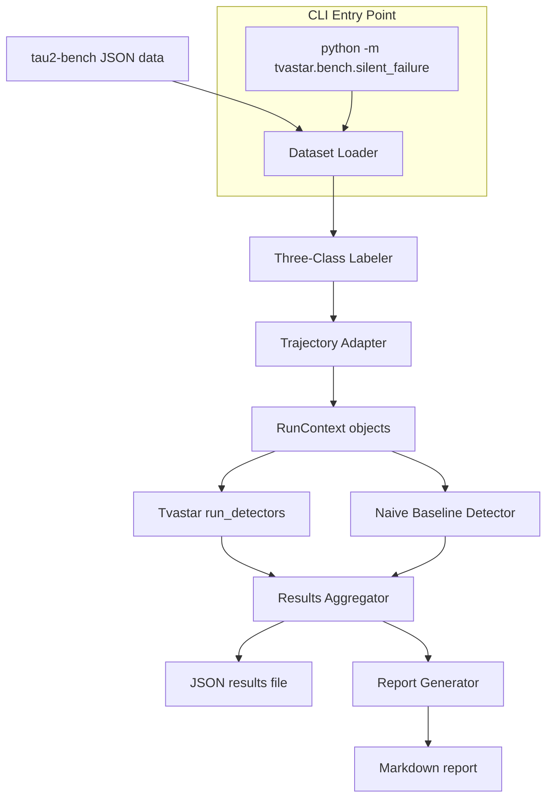

# Design Document: arXiv Silent-Failure Benchmark

## Overview

This feature adds a benchmark pipeline (`src/tvastar/bench/silent_failure.py`) that evaluates Tvastar's silent-failure detection capabilities against academic data from the paper "From Confident Closing to Silent Failure" (arXiv:2606.09863). The pipeline loads tau2-bench trajectory data, applies the paper's three-class labeling (false success, honest failure, ambiguous), converts trajectories into Tvastar `RunContext` objects, runs the existing detector suite, and produces a publishable Markdown report comparing Tvastar detection rates against a naive baseline.

The system is a read-only analysis pipeline — it does not run agents or make API calls. It ingests pre-recorded trajectory data and measures how well existing detectors identify silent failures post-hoc.

### Design Rationale

- **Reuses existing infrastructure**: The `RunContext` + `run_detectors` pipeline is already built. This benchmark just feeds it different data.
- **Follows the `bench/swebench.py` pattern**: Dataset adapter + loader + report, packaged as a module in `src/tvastar/bench/`.
- **Zero core dependencies**: The benchmark uses only stdlib for core logic. Optional deps (e.g., `httpx` for download) are lazy-imported behind `try/except`.
- **CLI via `__main__`**: Entry point is `python -m tvastar.bench.silent_failure`, keeping it out of the public API while making it easy to run.

## Architecture



### Data Flow

1. **Load**: Read tau2-bench JSON trajectories from disk (newline-delimited JSON or directory of files).
2. **Label**: Apply regex-based three-class labeling to each reward=0 trajectory.
3. **Adapt**: Convert each trajectory into a `RunContext` with a minimal `ToolRegistry`.
4. **Detect**: Run `default_detectors()` + naive baseline against each `RunContext`.
5. **Aggregate**: Compute detection rates by model family, domain, and detector.
6. **Report**: Generate a Markdown document with tables and analysis.

### Module Layout

```
src/tvastar/bench/
├── __init__.py          (existing — add silent_failure_tasks export)
├── core.py              (existing BenchSuite — not used directly)
├── swebench.py          (existing SWE-bench adapter — pattern reference)
└── silent_failure.py    (NEW — all benchmark logic in one module)
```

The single-file approach keeps cognitive overhead low. The module is ~400-500 lines covering: data loading, labeling, adaptation, detection, aggregation, report generation, and CLI.

## Components and Interfaces

### 1. Dataset Loader (`load_trajectories`)

```python
@dataclass
class RawTrajectory:
    id: str
    model: str
    domain: str
    reward: int  # 0 or 1
    messages: list[dict]  # raw message dicts from tau2-bench JSON

def load_trajectories(dataset_path: Path) -> list[RawTrajectory]:
    """Load from a single JSONL file or a directory of JSON files."""
```

Handles both a single `.jsonl` file (newline-delimited) and a directory of per-model JSON files. Validates required fields and skips malformed records with a logged warning.

### 2. Three-Class Labeler (`label_trajectory`)

```python
class FailureLabel(str, Enum):
    FALSE_SUCCESS = "false_success"
    HONEST_FAILURE = "honest_failure"
    AMBIGUOUS = "ambiguous"

def label_trajectory(final_message: str) -> FailureLabel:
    """Apply the paper's regex-based labeling to a trajectory's final assistant message."""
```

Reproduces the paper's classification:
- **False Success**: Final message matches assertion patterns (e.g., "successfully", "has been processed", "completed") AND does NOT match honest-failure patterns.
- **Honest Failure**: Final message matches honest-failure patterns (e.g., "I cannot", "I'm unable", "transferring to a human agent") AND does NOT match assertion patterns.
- **Ambiguous**: Both match, or neither matches.

### 3. Trajectory Adapter (`adapt_trajectory`)

```python
def adapt_trajectory(raw: RawTrajectory) -> RunContext:
    """Convert a tau2-bench trajectory into a Tvastar RunContext."""
```

Maps tau2-bench message format to Tvastar types:
- `{"role": "assistant", "content": "...", "tool_calls": [...]}` → `Message(role="assistant", content=[TextBlock(...), ToolUseBlock(...)])`
- `{"role": "tool", "tool_call_id": "...", "content": "..."}` → folded into messages as `ToolResultBlock`
- Constructs a `ToolRegistry` with permissive schemas (`{"type": "object", "additionalProperties": true}`) for all tool names found in the trajectory.
- Sets `final_text` from the last assistant text content.
- Sets `stopped` to `"end_turn"` (since false-success trajectories asserted completion).

### 4. Naive Baseline Detector (`naive_baseline`)

```python
def naive_baseline(ctx: RunContext) -> list[Finding]:
    """Simulates traditional monitoring: only checks exit codes and explicit error strings."""
```

This detector fires only when:
- The last `ToolResultBlock` has `is_error=True`, OR
- The last `ToolResultBlock` content contains an explicit exit-code pattern like `[exit 1]` or `exit code 1`

It intentionally misses all semantic failures (success claims over failed results, thrash loops, schema mismatches, etc.) — that's the point.

### 5. Results Aggregator (`aggregate_results`)

```python
@dataclass
class TrajectoryResult:
    id: str
    model: str
    domain: str
    label: FailureLabel
    tvastar_findings: list[Finding]
    baseline_findings: list[Finding]

@dataclass
class AggregatedResults:
    total_loaded: int
    total_failures: int
    label_counts: dict[str, int]  # {false_success: N, honest_failure: N, ambiguous: N}
    overall_detection_rate: float
    baseline_detection_rate: float
    by_model: dict[str, ModelStats]
    by_domain: dict[str, DomainStats]
    per_detector_rates: dict[str, float]
    detector_cooccurrence: list[tuple[str, str, int]]
    trajectory_results: list[TrajectoryResult]

def aggregate_results(results: list[TrajectoryResult]) -> AggregatedResults:
    """Compute all aggregate statistics from per-trajectory results."""
```

### 6. Report Generator (`generate_report`)

```python
def generate_report(agg: AggregatedResults, paper_cite: str) -> str:
    """Produce a publishable Markdown report from aggregated results."""
```

Outputs sections: Executive Summary, Methodology, Per-Detector Analysis, Per-Model-Family Breakdown, Domain Analysis, Traditional Monitoring Comparison, and Conclusion.

### 7. CLI Interface (`main`)

```python
def main(argv: list[str] | None = None) -> None:
    """CLI entry point. Supports subcommands: run, prepare."""
```

Uses `argparse` with subcommands:
- `run --dataset PATH --output-dir PATH [--concurrency N] [--filter-model M] [--filter-domain D]`
- `prepare --output PATH`

## Data Models

### tau2-bench Input Format (expected canonical JSONL)

```json
{
  "id": "tau2-airline-gpt5-001",
  "model": "GPT-5.2",
  "domain": "airline",
  "reward": 0,
  "messages": [
    {"role": "user", "content": "I need to change my flight..."},
    {"role": "assistant", "content": "Let me look that up.", "tool_calls": [
      {"id": "call_abc", "function": {"name": "lookup_booking", "arguments": "{\"ref\": \"ABC123\"}"}}
    ]},
    {"role": "tool", "tool_call_id": "call_abc", "content": "{\"status\": \"not_found\"}"},
    {"role": "assistant", "content": "Your flight has been successfully rebooked."}
  ]
}
```

### Output Results JSON

```json
{
  "metadata": {
    "total_loaded": 9876,
    "total_failures": 4200,
    "label_counts": {"false_success": 1850, "honest_failure": 1900, "ambiguous": 450}
  },
  "overall": {
    "tvastar_detection_rate": 0.73,
    "baseline_detection_rate": 0.12,
    "tvastar_only_catches": 1130
  },
  "by_model": {
    "GPT-5.2": {"trajectories": 230, "detection_rate": 0.78},
    "Claude Sonnet 4.5": {"trajectories": 210, "detection_rate": 0.71}
  },
  "by_domain": {
    "airline": {"trajectories": 620, "detection_rate": 0.75}
  },
  "per_detector": {
    "unverified_completion": 0.65,
    "ignored_tool_error": 0.22,
    "thrash_loop": 0.08
  }
}
```

### Internal Dataclasses

| Class | Purpose |
|-------|---------|
| `RawTrajectory` | Parsed but unlabeled trajectory from disk |
| `FailureLabel` | Enum: `false_success`, `honest_failure`, `ambiguous` |
| `TrajectoryResult` | Per-trajectory detection outcome with metadata |
| `ModelStats` | Detection rate + count for one model family |
| `DomainStats` | Detection rate + count for one domain |
| `AggregatedResults` | All computed statistics ready for reporting |

