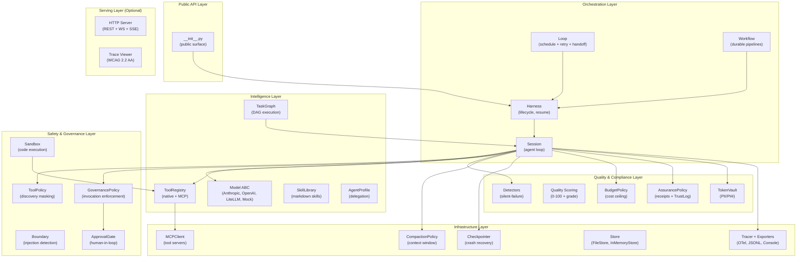
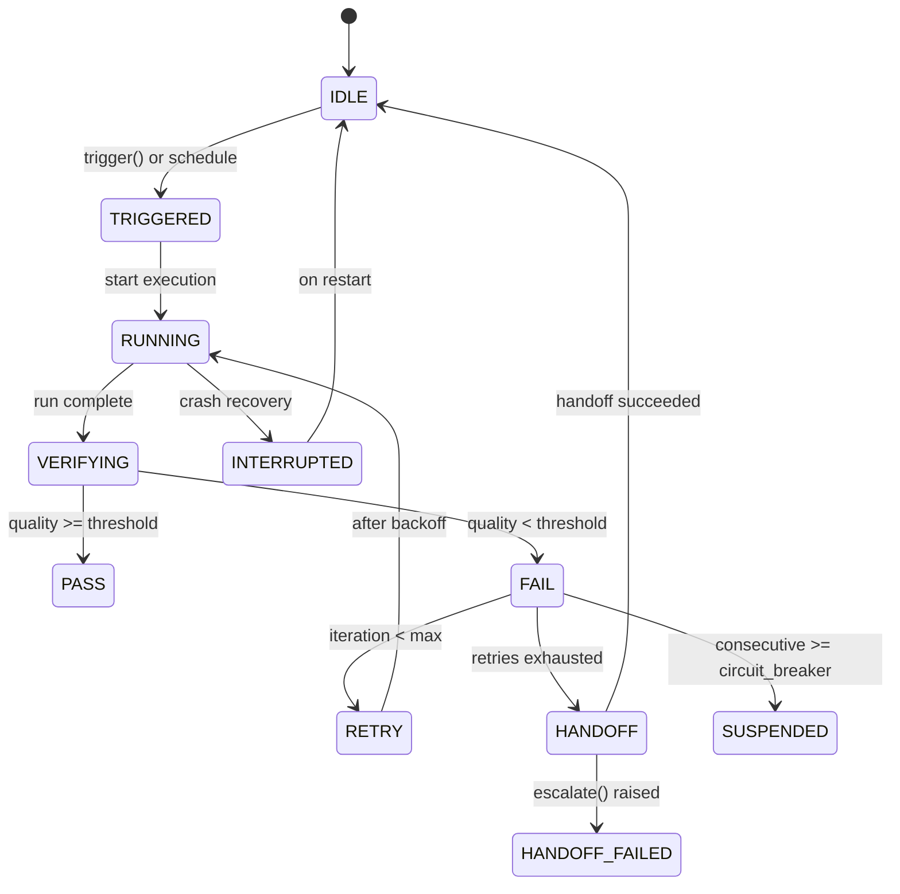
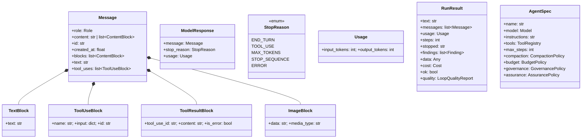
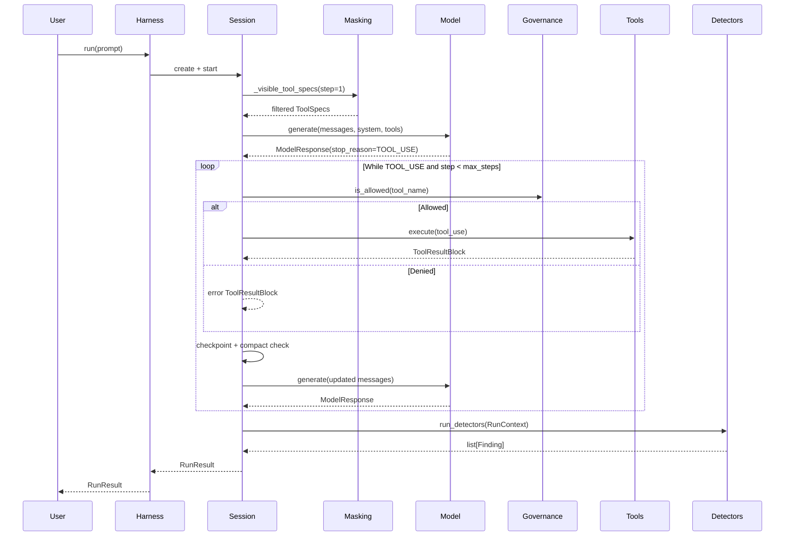
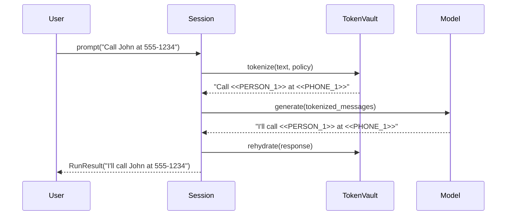

# Design Document — Vidura BA Analysis of Tvastar

## Overview

This design document describes the architecture, component interactions, data models, and correctness properties for **Tvastar** — a programmable agent harness for Python following the formula `Agent = Model + Harness; Loop = Agent + Schedule + Verify + Handoff`.

Tvastar provides a layered architecture where an immutable `AgentSpec` declaration is executed by a `Harness` across `Session` instances. The system enforces zero third-party runtime dependencies in its core, with optional extras (provider SDKs, OpenTelemetry, FastAPI) loaded lazily behind `try/except ImportError`.

**Key Design Principles:**
- Zero-dependency core: stdlib only, supply-chain risk at zero
- Verify, don't trust: silent-failure detection as core differentiator
- Graceful degradation: tracing/masking/compaction never break a run
- Declarative + programmable: AgentSpec is data; Harness is behavior

## Architecture

### System Layer Diagram



### Architectural Layers

| Layer | Responsibility | Failure Mode |
|-------|---------------|--------------|
| Public API | Single import surface; `__all__` enforcement | N/A — compile-time |
| Orchestration | Session lifecycle, loop scheduling, workflow pipelines | Propagates or returns partial RunResult |
| Intelligence | Model abstraction, tool dispatch, skill catalog, DAG parallelism | Provider errors propagate; tool errors in ToolResultBlock |
| Safety & Governance | Masking, governance, injection scan, sandbox, approval | Masking swallows errors; governance returns error blocks |
| Quality & Compliance | Detection, scoring, receipts, PII redaction, cost | Detectors post-hoc; budget may halt |
| Infrastructure | Tracing, checkpointing, compaction, store, MCP | All swallow errors except MCP (error block) |
| Serving | HTTP/WS/SSE endpoints, trace viewer UI | Optional extra; never imported in core |

### Key Design Decisions

1. **Immutable AgentSpec, mutable Session**: The spec is a pure declaration (what); the session is the execution state (how). Multiple sessions from one spec enables safe concurrency.

2. **GovernancePolicy runs in Python, not as a prompt instruction**: Prompt injection cannot bypass Python-level enforcement.

3. **Dual masking strategy**: Discovery masking (ToolPolicy) shapes what the model *considers*; invocation governance (GovernancePolicy) enforces what it *can do*.

4. **Fail-open masking, fail-closed governance**: ToolPolicy errors → expose all tools (run continues). Unknown governance phase → deny all tools (fail closed).

5. **Post-hoc detection, not prevention**: Detectors inspect completed runs. They never modify messages or halt execution.

## Components and Interfaces

### Session — The Agent Loop

The `Session` is the central execution engine implementing the model↔tool loop:

```
prompt → [masking] → model.generate → [governance] → tool.execute → append → repeat
                                     ↓ END_TURN
                              [detect] → [score] → [assure] → RunResult
```

**Interface:**
- `prompt(text, *, result=None, images=None) → RunResult`
- `skill(name, text) → RunResult`
- `task(text, *, agent=None, cancel_after=None) → RunResult`
- `stream(text) → AsyncIterator[StreamEvent]`

**Per-turn hooks:**
1. `_visible_tool_specs(step)` — apply ToolPolicy masking
2. `_system_prompt()` — compose instructions + skills + hook
3. `_execute_tools(uses)` — governance check → dispatch → results
4. `_maybe_compact()` — trigger compaction if threshold met
5. `_checkpoint()` — persist to Store if configured
6. `_detect(result)` — run all detectors post-loop
7. `_assure(result)` — sign receipt if AssurancePolicy configured

### Harness — Lifecycle Manager

Owns sandbox, store, tracer, and session pool:
- `session(*, id=None, tracer=None) → Session`
- `resume(session_id) → Optional[Session]`
- `run(text, **kwargs) → RunResult` (convenience: session + prompt + close)
- `fan_out(prompts) → list[RunResult]` (parallel sessions)

### Loop — Autonomous Scheduling

State machine: `IDLE → TRIGGERED → RUNNING → VERIFYING → PASS/FAIL → RETRY/HANDOFF/SUSPENDED`



### Safety Subsystems

**Tool Masking Pipeline:**
```
available_tools → ToolPolicy(MaskContext) → visible_subset → model.generate
                       ↓ (raises)
                  fallback: all tools
```

**Governance Enforcement:**
```
model requests tool_call → GovernancePolicy.is_allowed(tool_name)
    ├─ True  → execute tool normally
    ├─ False + ApprovalGate → request approval → execute or error block
    └─ False + no gate → error ToolResultBlock
```

**Sandbox Execution:**
```
SecurityPolicy.check(command)
    ├─ denied_substrings match → SecurityViolation
    ├─ allowed_commands miss  → SecurityViolation
    ├─ denied_commands match  → SecurityViolation
    └─ pass → CredentialFilter(env) → subprocess.run(timeout) → ExecResult
```

### Quality & Compliance Subsystems

**Silent-Failure Detection** — Detectors are pure functions: `(RunContext) → list[Finding]`

| Detector | Trigger | Severity |
|----------|---------|----------|
| `unverified_completion` | Success claim + tool failure evidence | ERROR |
| `thrash_loop` | Same tool+args repeated > threshold | WARNING |
| `unknown_tool` | Tool name not in registry | ERROR |
| `schema_mismatch` | Arguments violate tool schema | ERROR |
| `prompt_injection` | Tool output matches injection patterns | WARNING |
| `ignored_tool_error` | END_TURN after unrecovered tool error | WARNING |
| `empty_answer` | Empty final assistant text | WARNING |

**Quality Scoring** — `score_run(RunResult) → LoopQualityReport`:
- Start at 100; deduct 30/ERROR, 10/WARNING, 20/max_steps, 50/error
- Clamp [0, 100]; Grade: ≥80 PASS, ≥60 WARN, <60 FAIL

**Verifiable Execution:**
```
RunResult → ExecutionReceipt.from_run_result(key)
               ├── content_hash: SHA-256 of canonical payload
               ├── signature: HMAC(content_hash, key)
               └── prev_hash: links to prior receipt in TrustLog
```

**PII/PHI Sanitization:**
```
prompt → TokenVault.tokenize(text, policy) → redacted → model
response ← TokenVault.rehydrate(text) ← raw_response
Invariant: vault.rehydrate(vault.tokenize(text)) == text
```

### Infrastructure Subsystems

**Observability:** Session emits spans via Tracer → exporters (Console, JSONL, OTel). Exporter failures are swallowed.

**Context Compaction:** When `len(messages) > max_messages` or `tokens > max_tokens_estimate`, summarise oldest messages keeping `keep_last` tail intact.

**Durable Execution:** `Checkpointer(Store).save()` after each tool turn. `Harness.resume()` restores from checkpoint.

**DAG Task Execution:** `TaskGraph.run()` executes tasks in topological order with independent tasks running concurrently. Cycles rejected at construction.

## Data Models

### Core Type Hierarchy



### Key Data Structures

| Type | Module | Purpose |
|------|--------|---------|
| `Message` | types.py | Single conversation turn with content blocks |
| `ModelResponse` | types.py | Model reply with stop reason and token usage |
| `RunResult` | session.py | Complete run outcome with findings and quality |
| `Finding` | detect/base.py | Silent-failure signal (severity + message + evidence) |
| `LoopQualityReport` | quality.py | Score [0-100] + grade (PASS/WARN/FAIL) |
| `ExecutionReceipt` | assurance/receipt.py | Signed, chain-linked audit record |
| `Cost` | cost.py | Token cost with USD calculation from COST_TABLE |
| `BudgetPolicy` | cost.py | Cost ceiling with on_exceed strategy |
| `CompactionPolicy` | compaction.py | Thresholds: max_messages, keep_last, min_messages |
| `SecurityPolicy` | sandbox/base.py | allow/deny command rules + credential filter |
| `GovernancePolicy` | masking.py | Phase-based tool enforcement at invocation |
| `MaskContext` | masking.py | Read-only state for ToolPolicy decisions |
| `LoopConfig` | loop/__init__.py | Schedule, retries, circuit breaker, backoff |
| `LoopState` | loop/__init__.py | Enum: IDLE, TRIGGERED, RUNNING, etc. |
| `AgentProfile` | profiles.py | Named specialist subagent configuration |
| `Span` | observability.py | Trace span with attributes and parent linkage |
| `GraphResult` | graph.py | DAG execution outcome keyed by task name |
| `WorkflowRun` | workflow.py | Pipeline run with status and event history |
| `TokenVault` | assurance/sanitize.py | PII placeholder map with round-trip guarantee |

## Interaction Flows

### Agent Loop Execution (REQ-LOOP-001)



### Loop Engineering Flow (REQ-LOOP-ENG-001)

```mermaid
sequenceDiagram
    participant Scheduler
    participant Loop
    participant Store
    participant Harness
    participant HandoffPolicy

    Scheduler->>Loop: trigger(context)
    Loop->>Store: checkpoint(TRIGGERED)
    Loop->>Harness: run(prompt)
    Loop->>Store: checkpoint(RUNNING)
    Harness-->>Loop: RunResult
    Loop->>Loop: score_run -> quality
    Loop->>Store: checkpoint(VERIFYING)
    
    alt quality >= threshold
        Loop->>Store: checkpoint(PASS)
    else quality < threshold
        Loop->>Store: checkpoint(FAIL)
        alt iteration < max_iterations
            Loop->>Loop: backoff = base * 2^(iter-1)
            Loop->>Store: checkpoint(RETRY)
        else retries exhausted
            Loop->>HandoffPolicy: escalate(run)
            Loop->>Store: checkpoint(HANDOFF)
        end
    end
```

### PII Sanitization Flow (REQ-SANITIZE-001)



## Error Handling

### Error Hierarchy

```
TvastarError (base)
├── ModelError          → propagates (model is broken)
├── ToolError           → captured in ToolResultBlock(is_error=True)
│   └── ToolNotFound    → captured + Finding(ERROR)
├── SandboxError        → captured in ExecResult
│   └── SecurityViolation → raised before execution
├── SkillError          → propagates
├── DurableError        → propagates (checkpoint failure)
├── BudgetExceeded      → propagates or stops (configurable)
├── ApprovalDenied      → tool returns error result
├── ApprovalTimeout     → tool returns error result
└── SLABreached         → propagates (assurance)
```

### Strategies by Layer

| Layer | Strategy | Rationale |
|-------|----------|-----------|
| Model.generate | Propagate (except overflow) | Caller handles API failures |
| ToolPolicy | Swallow → fallback all tools | CON-004: never break a run |
| Tracer/Exporter | Swallow → stderr warning | CON-004: observability is best-effort |
| Compaction | Swallow → keep original messages | CON-004: advisory |
| GovernancePolicy | Return error ToolResultBlock | Loop stays alive; model self-corrects |
| SecurityPolicy | Raise SecurityViolation | Hard boundary |
| BudgetPolicy | Raise or stop (on_exceed config) | Explicit user choice |
| Checkpoint read | Return None | Graceful on corrupt state |
| TrustLog.append | Propagate | Audit gaps must be visible (RSK-006) |

### Critical Invariant: Wrapper Layers Never Break Runs

These components MUST follow try/except + fallback:
1. **Masking** — returns None on failure (all tools exposed)
2. **Tracing** — catches exporter exceptions, prints to stderr
3. **Compaction** — returns original messages on failure
4. **System prompt hook** — returns unhooked prompt on failure
5. **Content filter** — skips filtering on failure

### Context Overflow Recovery

```python
try:
    response = await model.generate(...)
except Exception as e:
    if _is_context_overflow(e) and self.spec.compaction:
        await self._maybe_compact()  # force compaction
        response = await model.generate(...)  # retry once
    else:
        raise
```

## Security Design

### Defense-in-Depth Layers

```
Layer 1: Tool Masking (discovery)    — shapes what the model considers
Layer 2: Governance (invocation)     — enforces what the model can do
Layer 3: Injection Detection         — surfaces suspicious content
Layer 4: Content Boundary            — fences untrusted data
Layer 5: Sandbox + SecurityPolicy    — isolates code execution
Layer 6: Credential Filter           — strips secrets from env
Layer 7: PII Sanitization            — redacts before model + logs
Layer 8: Audit Trail                 — proves what happened (receipts)
```

### Trust Boundaries

```
┌──────────────────────────────────────────────┐
│ TRUSTED: Python runtime (harness code)       │
│ ┌──────────────────────────────────────────┐ │
│ │ SEMI-TRUSTED: Model output               │ │
│ │ (may contain injection attempts)         │ │
│ │ ┌──────────────────────────────────────┐ │ │
│ │ │ UNTRUSTED: Tool output               │ │ │
│ │ │ (external data, user content)        │ │ │
│ │ └──────────────────────────────────────┘ │ │
│ └──────────────────────────────────────────┘ │
│ ┌──────────────────────────────────────────┐ │
│ │ UNTRUSTED: Agent-generated code          │ │
│ │ (executes in sandbox)                    │ │
│ └──────────────────────────────────────────┘ │
└──────────────────────────────────────────────┘
```

### Key Security Decisions

1. **GovernancePolicy is Python-level enforcement** — cannot be bypassed via prompt injection
2. **Fail-closed governance** — unknown phases deny all tools
3. **Injection detection is honest mitigation** — named "detection/mitigation", never "protection"
4. **VirtualSandbox is not a security boundary** — documented as convenience-only
5. **CredentialFilter removes env vars before subprocess** — glob patterns for secrets
6. **ExecutionReceipt uses HMAC-SHA256** — chain-linked via prev_hash, optional PQC support
7. **TokenVault replaces PII with opaque placeholders** — model never sees raw PII
8. **Trace viewer HTML-escapes dynamic content** — prevents stored XSS (RSK-010)

## Correctness Properties

*A property is a characteristic or behavior that should hold true across all valid executions of a system — essentially, a formal statement about what the system should do. Properties serve as the bridge between human-readable specifications and machine-verifiable correctness guarantees.*

### Redundancy Reflection

After analyzing all 24 requirements and their acceptance criteria, these consolidations were applied:
1. Criteria 3.3-3.5 (grade boundaries) → single score-to-grade property
2. Criteria 4.1-4.3 (SecurityPolicy checks) → single enforcement property
3. Criteria 6.1-6.5 (injection patterns) → single detection completeness property
4. Criteria 8.3-8.4 (receipt verify) → single sign-verify round-trip
5. Criteria 12.2-12.3 (budget modes) → single budget enforcement property
6. Criteria 15.1-15.2 (DAG ordering) → single topological execution property

---

### Property 1: Agent loop termination

*For any* AgentSpec with max_steps=N and a model that always returns TOOL_USE, the Session SHALL terminate with stopped="max_steps" after exactly N steps.

**Validates: Requirements 1.4**

### Property 2: Tool execution grows message history

*For any* ModelResponse with stop_reason=TOOL_USE containing T tool calls, the Session SHALL append one assistant message and one tool-results message per loop iteration.

**Validates: Requirements 1.2**

### Property 3: Non-overflow exceptions propagate

*For any* exception raised by model.generate that is NOT a context overflow, the Session SHALL propagate it to the caller without catching.

**Validates: Requirements 1.5**

### Property 4: Context overflow triggers single retry

*For any* context overflow error when a CompactionPolicy is configured, the Session SHALL compact the history and retry model.generate exactly once.

**Validates: Requirements 1.6**

### Property 5: Detector execution completeness

*For any* completed RunResult and N configured detectors, all N detectors SHALL execute and their combined findings SHALL appear in RunResult.findings.

**Validates: Requirements 2.8**

### Property 6: Unverified completion detection

*For any* RunResult where the final assistant text contains a success-claim pattern AND the last tool result contains a failure signal, the unverified_completion detector SHALL emit a Finding with Severity.ERROR.

**Validates: Requirements 2.1**

### Property 7: Thrash loop detection

*For any* message history where the same tool+args combination appears more than threshold times, the thrash_loop detector SHALL emit a Finding with Severity.WARNING.

**Validates: Requirements 2.2**

### Property 8: Quality score arithmetic

*For any* RunResult with E error findings, W warning findings, and stopped reason S, score_run SHALL produce max(0, 100 - 30E - 10W - penalty(S)) where penalty is 20 for max_steps, 50 for error, 0 otherwise. Grade is PASS≥80, WARN≥60, FAIL<60.

**Validates: Requirements 3.1, 3.2, 3.3, 3.4, 3.5**

### Property 9: SecurityPolicy enforcement

*For any* command and SecurityPolicy, if the command matches any denied_substrings entry, OR its first token is in denied_commands, OR (allowed_commands is non-empty AND first token is absent), THEN SecurityViolation SHALL be raised.

**Validates: Requirements 4.1, 4.2, 4.3**

### Property 10: CredentialFilter completeness

*For any* environment variable set and CredentialFilter with glob patterns, after filtering, no variable whose name matches any pattern SHALL remain.

**Validates: Requirements 4.4**

### Property 11: ToolPolicy subset invariant

*For any* ToolPolicy and MaskContext with available tools A, the set returned by the policy intersected with A SHALL be a subset of A. A policy can never grant tools not in the available set.

**Validates: Requirements 5.1**

### Property 12: Masking failure fallback

*For any* ToolPolicy that raises an exception, apply_policy() SHALL return None (all tools exposed), ensuring masking never breaks a run.

**Validates: Requirements 5.2**

### Property 13: Governance fails closed on unknown phases

*For any* GovernancePolicy and any phase name not in its phases dictionary, is_allowed(tool_name) SHALL return False for all tool names.

**Validates: Requirements 5.5**

### Property 14: GovernancePolicy copy independence

*For any* GovernancePolicy, copy() SHALL produce an instance where set_phase() on the copy does not affect the original's current_phase, and vice versa.

**Validates: Requirements 5.6**

### Property 15: Injection pattern detection completeness

*For any* text matching one of the five injection patterns (override_instructions, role_reassignment, exfiltration, fake_system_turn, reveal_system_prompt), scan_for_injection SHALL return a list containing the matched pattern name(s).

**Validates: Requirements 6.1, 6.2, 6.3, 6.4, 6.5**

### Property 16: Untrusted content wrapping

*For any* content string, wrap_untrusted(content) SHALL return a string containing the TVASTAR_UNTRUSTED_CONTENT sentinels and a do-not-follow-instructions notice, with the original content preserved within.

**Validates: Requirements 6.6**

### Property 17: Loop state checkpointing

*For any* Loop with a configured Store, every state transition SHALL be persisted to the Store such that a crash at any point allows recovery from the last checkpointed state.

**Validates: Requirements 7.7**

### Property 18: Exponential backoff calculation

*For any* LoopConfig with backoff_base=B and failed iteration I (I < max_iterations), the retry delay SHALL be B * 2^(I-1) seconds.

**Validates: Requirements 7.2**

### Property 19: Circuit breaker activation

*For any* Loop with consecutive_failures >= circuit_breaker_limit, the state SHALL transition to SUSPENDED.

**Validates: Requirements 7.4**

### Property 20: Receipt sign-verify round-trip

*For any* valid RunResult data and signing key K, creating an ExecutionReceipt and calling receipt.verify(K) SHALL return True. Modifying any field after signing and calling verify(K) SHALL return False.

**Validates: Requirements 8.3, 8.4**

### Property 21: TrustLog chain integrity

*For any* sequence of N receipts appended to a TrustLog, verify_chain() SHALL return True. If any receipt's content is tampered, verify_chain() SHALL return False and identify the corrupted entry.

**Validates: Requirements 8.5, 8.6**

### Property 22: TokenVault round-trip

*For any* valid input string containing sensitive patterns matching a SanitizationPolicy, vault.rehydrate(vault.tokenize(text, policy)) SHALL produce the original string.

**Validates: Requirements 9.5**

### Property 23: Compaction preserves tail

*For any* message list M with len(M) > keep_last and CompactionPolicy with keep_last=K, after compaction the last K messages SHALL be identical to the last K messages of the original list.

**Validates: Requirements 10.2**

### Property 24: Compaction respects min_messages

*For any* message list and CompactionPolicy where len(messages) < min_messages, should_compact() SHALL return False and no compaction occurs.

**Validates: Requirements 10.4**

### Property 25: Compaction failure does not break run

*For any* compaction failure (exception during summarization), the Session SHALL continue with the original message list unchanged.

**Validates: Requirements 10.6**

### Property 26: Checkpoint round-trip

*For any* session with messages M and a Store, after checkpointing, harness.resume(session_id) SHALL produce a session with messages equivalent to M.

**Validates: Requirements 11.1, 11.2**

### Property 27: Cost monotonicity

*For any* sequence of model.generate calls within a run, cumulative cost.usd SHALL be monotonically non-decreasing.

**Validates: Requirements 12.1, 12.6**

### Property 28: Budget enforcement

*For any* BudgetPolicy with max_usd=X, when cumulative cost.usd >= X: on_exceed="raise" SHALL raise BudgetExceeded; on_exceed="stop" SHALL return stopped="budget".

**Validates: Requirements 12.2, 12.3**

### Property 29: Tracer failure isolation

*For any* Tracer or Exporter that raises during span export, the Session SHALL swallow the error and complete the run normally.

**Validates: Requirements 13.4**

### Property 30: DAG topological execution

*For any* TaskGraph, no task SHALL begin before all its dependencies have completed. Independent tasks SHALL be eligible for concurrent execution.

**Validates: Requirements 15.1, 15.2**

### Property 31: DAG cycle rejection

*For any* task dependency set forming a cycle, TaskGraph construction SHALL raise ValueError.

**Validates: Requirements 15.3**

### Property 32: Task delegation depth bound

*For any* chain of session.task() delegations, task_depth SHALL never exceed MAX_TASK_DEPTH (4). At the limit, RuntimeError SHALL be raised.

**Validates: Requirements 18.2**

### Property 33: Child spec precedence

*For any* combination of parent AgentSpec, AgentProfile, and task() overrides, child spec resolution SHALL follow: task override > profile > parent.

**Validates: Requirements 18.3**

### Property 34: Structured output schema injection

*For any* schema passed as result= parameter, the Session SHALL inject a JSON schema instruction into the model prompt. Valid model JSON matching the schema SHALL be parsed into RunResult.data.

**Validates: Requirements 19.1, 19.2**

### Property 35: Tool retry backoff formula

*For any* ToolRetryPolicy with backoff_base=B, backoff_max=M, jitter=J, the delay for attempt A SHALL be min(M, B * 2^A) + random(0, J).

**Validates: Requirements 23.2, 23.3**

## Testing Strategy

### Dual Testing Approach

| Strategy | Purpose | Tools |
|----------|---------|-------|
| Property-based tests | Universal invariants across all valid inputs | Hypothesis (Python) |
| Unit tests | Specific examples, edge cases, error conditions | pytest (async mode) |
| Integration tests | External system behavior (MCP, HTTP, OTel) | pytest + servers |
| Adversarial tests | Security boundary validation | pytest + crafted payloads |
| Accessibility audit | WCAG 2.2 AA compliance | axe-core + manual |

### Property-Based Testing Configuration

- **Library**: Hypothesis for Python
- **Minimum iterations**: 100 per property test
- **Tag format**: `# Feature: vidura-ba-analysis, Property {N}: {title}`
- **Runner**: pytest with `asyncio_mode = "auto"`
- **Mock strategy**: MockModel for all PBT — no API keys required

### Property Test Coverage Map

| Property | Target Function | Generator Strategy |
|----------|----------------|-------------------|
| P1: Loop termination | `Session._run_loop` | Random max_steps [1..50], MockModel always TOOL_USE |
| P8: Quality scoring | `score_run` | Random Finding lists + stop reasons |
| P9: SecurityPolicy | `SecurityPolicy.check` | Random commands × random deny/allow rules |
| P10: CredentialFilter | `CredentialFilter` | Random env var names × glob patterns |
| P11: ToolPolicy subset | `apply_policy` | Random policies × MaskContexts |
| P13: Governance fail-closed | `GovernancePolicy.is_allowed` | Random phase names not in phases dict |
| P14: Governance copy | `GovernancePolicy.copy` | Random policies, mutate copy |
| P15: Injection detection | `scan_for_injection` | Strings generated from pattern templates |
| P16: wrap_untrusted | `wrap_untrusted` | Random content strings (incl. unicode) |
| P18: Backoff calculation | Loop retry delay | Random base/iteration values |
| P20: Receipt round-trip | `ExecutionReceipt.verify` | Random receipt payloads + keys |
| P21: TrustLog chain | `TrustLog.verify_chain` | Random receipt sequences + corruption |
| P22: TokenVault | `tokenize` + `rehydrate` | Random strings with PII patterns |
| P23: Compaction tail | `compact_messages` | Random message lists + keep_last values |
| P26: Checkpoint round-trip | `Checkpointer.save`/`load` | Random message lists with all block types |
| P28: Budget enforcement | Session budget check | Random max_usd × random cumulative costs |
| P30: DAG ordering | `TaskGraph.run` | Random valid DAGs |
| P31: Cycle rejection | `TaskGraph._validate` | Random cyclic dependency graphs |
| P32: Depth bound | `Session.task` | Nested delegation at increasing depths |
| P35: Tool retry | Retry delay computation | Random configs × attempt counts |

### Non-PBT Test Areas

| Area | Why Not PBT | Approach |
|------|-------------|----------|
| WCAG 2.2 AA (REQ-A11Y-001) | UI accessibility not computable | Manual audit + axe-core |
| MCP integration (REQ-MCP-001) | External server | Integration with echo server |
| HTTP serving (REQ-SERVE-001) | FastAPI optional dep | TestClient integration |
| Model adapters (REQ-MODEL-001) | SDK-specific | Conformance test per adapter |
| Zero-dep core (REQ-DEPS-001) | Package metadata | CI assertion |
| Workflow pipelines (REQ-WORKFLOW-001) | State machine transitions | Example-based unit tests |
| Human approval (REQ-APPROVE-001) | Interactive flow | Mock gate unit tests |

### Test Infrastructure

```python
# All PBT uses MockModel — no API keys needed
from tvastar import MockModel, create_agent, Harness
from hypothesis import given, strategies as st

@given(max_steps=st.integers(min_value=1, max_value=50))
async def test_loop_termination(max_steps):
    model = MockModel(responses=[...])  # always TOOL_USE
    agent = create_agent("test", model=model, max_steps=max_steps)
    harness = Harness(agent)
    result = await harness.run("test")
    assert result.steps == max_steps
    assert result.stopped == "max_steps"
```
